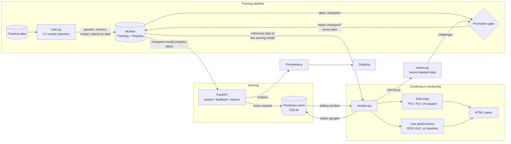

# End-to-End MLOps Pipeline with Continuous Drift Monitoring

[](https://github.com/YOUR_USERNAME/mlops-drift-monitoring/actions)


A production-style machine-learning system that **doesn't stop at `model.fit()`**. It trains and versions a
customer-churn model, serves it behind a REST API, logs every prediction, **continuously monitors data drift and
live model performance**, and **automatically retrains and promotes a new model** when the world changes, guarded
by a champion/challenger gate.


> *22 simulated weeks, produced by `mlops demo` (about a minute on a laptop). Covariate drift is injected from
> week 4 and concept drift from week 9. Every number in this README comes from that run.*

---

## Table of contents

1. [The problem](#1-the-problem)
2. [What the system does](#2-what-the-system-does)
3. [Results of the simulation](#3-results-of-the-simulation)
4. [Architecture](#4-architecture)
5. [Quick start](#5-quick-start)
6. [How it works in detail](#6-how-it-works-in-detail)
7. [File-by-file reference](#7-file-by-file-reference)
8. [Configuration reference](#8-configuration-reference)
9. [API reference](#9-api-reference)
10. [Observability: metrics, dashboard, alerts](#10-observability-metrics-dashboard-alerts)
11. [Testing](#11-testing)
12. [Design decisions and limitations](#12-design-decisions-and-limitations)
13. [Roadmap](#13-roadmap)

---

## 1. The problem

A model that scored well on a test set in the notebook starts degrading the day it is deployed. Customers change,
prices change, upstream data pipelines change. Nobody notices until the business metric moves, often weeks later,
because the true outcome (*did the customer actually churn?*) arrives with a delay.

This project answers three production questions:

| Question | How the project answers it |
|---|---|
| **Is the data the model sees today different from what it was trained on?** | Per-feature statistical drift tests (PSI, KS, chi-square) on a sliding window, no labels needed |
| **Is the model actually getting worse?** | Live ROC-AUC computed on delayed ground-truth labels, compared with the model's baseline |
| **What should happen when it does?** | Guarded automatic retraining; the new model is promoted only if it beats the current one on unseen recent data |

---

## 2. What the system does

1. **Trains** three candidate models (logistic regression, random forest, gradient boosting), selects the best by
   cross-validation, and logs parameters, metrics, the model and its **reference dataset** to MLflow.
2. **Registers and promotes** the model by moving a registry alias called `champion`.
3. **Serves** the champion through a FastAPI service. Every request is persisted. The service hot-reloads when the
   alias moves, so promotion and rollback need no redeploy.
4. **Accepts feedback**: ground-truth labels arrive later through `/feedback` and are joined to the original predictions.
5. **Monitors** continuously: drift per feature, drift of predicted probabilities, and live performance.
   Produces a status (`OK`, `WARNING`, `CRITICAL`, `INSUFFICIENT_DATA`), a recommended action, and a self-contained
   HTML report.
6. **Retrains automatically** on `CRITICAL`, with safeguards (cooldown, minimum labeled data, hold-out gate).
7. **Exposes metrics** to Prometheus and a provisioned Grafana dashboard.
8. **Simulates months of production** in about a minute, so the whole loop can be demonstrated and tested.

---

## 3. Results of the simulation

Produced by `mlops demo` (22 weeks, about 800 customers per week, labels arrive one week late).

| Week | What happened | System response |
|---|---|---|
| 0-4 | Stable traffic | `OK`, zero false alarms |
| 5-6 | `monthly_charges`, then `num_support_calls` start to shift | `WARNING`: drift visible **before any labels exist** |
| 7 | 3 of 9 features drifted (>= 30 % threshold) | `CRITICAL`, auto-retrain, challenger beats champion on a hold-out, **v2 promoted** |
| 9 | Retrain attempted | v3 did **not** beat the champion, **rejected by the gate** |
| 11 | Drift keeps growing | v4 promoted; against its new reference, drift drops to 0 % |
| 14 | Concept drift: **zero feature drift**, live AUC drops to 0.72 | Only the performance monitor catches it, retrain, **v5 promoted** |

Week 14 is why both kinds of monitoring exist. Concept drift changes `P(y|x)`, not `P(x)`, so no
input-distribution test can see it. Only delayed labels reveal it.

The full per-week table is in [`docs/demo_timeline.csv`](docs/demo_timeline.csv) and a sample monitoring report is in
[`docs/sample_drift_report.html`](docs/sample_drift_report.html) (download it and open it in a browser).

---

## 4. Architecture



### Key design ideas

- **Reference data travels with the model.** The training sample is stored as an MLflow artifact on the same run as
  the model. The monitor therefore always compares production against exactly what the *serving* model learned from,
  including after a retrain.
- **Promotion is moving an alias.** The API resolves `models:/churn-classifier@champion`. Rolling back is one alias move.
- **Preprocessing lives inside the model.** One scikit-learn `Pipeline` holds imputation, scaling, encoding and the
  estimator, so training/serving skew cannot occur.
- **Champion vs challenger on the same unseen data.** Both are scored on a recent hold-out the challenger never saw.
- **Realistic label delay.** Performance monitoring only uses rows that already have a label *and* were scored by the
  current champion, so a freshly promoted model is never blamed for its predecessor's mistakes.

---

## 5. Quick start

### Option A: Python only (no Docker), about 2 minutes

```bash
git clone https://github.com/YOUR_USERNAME/mlops-drift-monitoring.git
cd mlops-drift-monitoring
python -m venv .venv && source .venv/bin/activate      # Windows: .venv\Scripts\activate
pip install -e ".[dev]"

mlops demo --plot docs/images/demo_timeline.png        # the full 22-week simulation
open state/demo/reports/latest.html                    # latest drift report
mlflow ui --backend-store-uri sqlite:///state/demo/mlflow.db   # experiments + model registry
```

Run the pieces yourself, each in its own terminal:

```bash
mlops train                                    # train, register, promote the first champion
mlops serve                                    # API on http://localhost:8000/docs
python scripts/traffic_generator.py            # synthetic traffic that drifts over time
mlops monitor --loop --interval 60             # continuous monitoring + auto-retrain
mlops status                                   # champion, traffic, recent monitoring runs
```

Use your own data: `mlops train --data your.csv` (columns must match [`schema.py`](src/mlops_pipeline/schema.py),
plus a `churn` target).

### Option B: full stack with Docker Compose

```bash
docker compose --profile demo up --build
```

| Service | URL | Purpose |
|---|---|---|
| API | http://localhost:8000/docs | inference, feedback, `/metrics` |
| MLflow | http://localhost:5000 | experiments, model registry |
| Grafana | http://localhost:3000 (admin / admin) | live drift and performance dashboard |
| Prometheus | http://localhost:9090 | metrics store |
| Reports | http://localhost:8080/latest.html | latest HTML drift report |

The `traffic` service (profile `demo`) sends synthetic customers and injects drift after about 4 minutes, so you can
watch the dashboard turn from green to red and the serving model version change on its own.

### Makefile shortcuts

`make install`, `make test`, `make lint`, `make demo`, `make train`, `make serve`, `make monitor`, `make traffic`,
`make up`, `make down`, `make clean`.

---

## 6. How it works in detail

### 6.1 The data (and why it is synthetic)

Real datasets are static snapshots. To prove a monitoring system works you need data whose production behaviour you
can change on purpose and then check that the system noticed. [`generator.py`](src/mlops_pipeline/data/generator.py)
creates telecom customers (tenure, age, monthly and total charges, support calls, contract type, internet service,
payment method, partner) with a churn label from a known logistic function, and a `DriftSpec` that injects:

| Drift type | What changes | Detectable without labels? |
|---|---|---|
| **Covariate drift** | Input distributions: higher bills, more support calls, more month-to-month contracts | Yes |
| **Concept drift** | The label function: contract and support calls become weaker predictors, tenure protects less, price matters more, and a hidden factor (think "competitor promotion") starts driving churn | No, only via performance |

### 6.2 Training

[`train.py`](src/mlops_pipeline/training/train.py): stratified train/test split, then 5-fold cross-validated ROC-AUC
for each candidate (one **nested MLflow run** per candidate), best candidate refit and scored on the test split. The
parent MLflow run logs parameters, test metrics (ROC-AUC, average precision, F1, Brier), a data fingerprint (hash, for
lineage), the model with an inferred signature and input example, and the **reference dataset** as an artifact.

### 6.3 Promotion gate

[`promote.py`](src/mlops_pipeline/training/promote.py):

- **No champion yet:** promote if test AUC is at least `min_absolute_auc`.
- **Champion exists:** score both models on the same hold-out; the challenger must be *strictly* better by
  `min_auc_improvement` and above the absolute floor. A tie never dethrones the champion.
- On promotion the registry alias moves and the version is tagged with `baseline_auc` (the performance the monitor will
  expect from it).

### 6.4 Serving

[`predictor.py`](src/mlops_pipeline/serving/predictor.py) holds a thread-safe `ModelManager` that loads the champion
and re-checks the alias at most every `model_refresh_seconds`; if the version changed it swaps the model in memory.
[`api.py`](src/mlops_pipeline/serving/api.py) wraps it in FastAPI with strict pydantic validation. Every prediction is
written to the SQLite prediction store with its features, probability, model version and timestamp: this log is the
data source for monitoring. The same `ModelManager` is used by the simulation, so demos and production exercise
identical code.

### 6.5 Drift detection

[`drift.py`](src/mlops_pipeline/monitoring/drift.py), implemented directly on SciPy:

| | Numeric | Categorical |
|---|---|---|
| Significance test | two-sample Kolmogorov-Smirnov | chi-square test of homogeneity |
| Effect size | KS statistic | Jensen-Shannon distance |
| Stability index | PSI on reference-quantile bins | PSI on category proportions |

A feature is flagged if **PSI >= 0.2**, *or* **p < 0.05 and effect size >= 0.1**. The effect-size guard is deliberate:
with thousands of rows, p-values flag differences too small to matter. **Dataset drift** means at least 30 % of
features are flagged. Unseen categories and constant reference columns are handled without errors. Prediction drift
(PSI of the model's predicted probabilities against the reference) is reported on every run. Details and rationale:
[`docs/monitoring_methodology.md`](docs/monitoring_methodology.md).

### 6.6 Performance monitoring

[`performance.py`](src/mlops_pipeline/monitoring/performance.py) computes ROC-AUC, average precision, F1 and Brier
score on rows that have a label and were scored by the current champion. It refuses to evaluate with fewer than
`min_labeled_samples` rows or when only one class is present, and flags degradation when
`baseline_auc - live_auc > max_auc_drop`.

### 6.7 Decision logic

[`monitor.py`](src/mlops_pipeline/monitoring/monitor.py) turns the evidence into a status and an action:

| Status | Condition | Action |
|---|---|---|
| `INSUFFICIENT_DATA` | fewer than `min_samples` predictions in the window | none |
| `OK` | no drift, no degradation | none |
| `WARNING` | some features drifted, below the dataset threshold | `WATCH` |
| `CRITICAL` | dataset drift **or** live AUC too far below baseline | `RETRAIN` |

Each run writes an HTML report, saves a row to `monitoring_runs`, and, if enabled, triggers retraining.

### 6.8 Automated retraining

[`retrain.py`](src/mlops_pipeline/pipeline/retrain.py):

1. **Cooldown:** skip if a retrain *attempt* (successful or not) happened within `cooldown_hours`.
2. **Data volume:** need at least `min_labeled_samples` labeled rows in the lookback window.
3. Split recent labeled data into a training part and a hold-out (`holdout_fraction`); mix in a small sample of the old
   reference (`history_rows`) for stability on rare segments.
4. Train a challenger. Its drift reference is the **recent** data, the "new normal".
5. Run the promotion gate on the hold-out; record the outcome in `retrain_events`.

---

## 7. File-by-file reference

### Repository root

| File | Purpose |
|---|---|
| `README.md` | This document |
| `pyproject.toml` | Package metadata, dependencies (MLflow pinned `<3`, SQLAlchemy `<2.1`), the `mlops` console command, pytest and ruff settings |
| `Makefile` | Shortcuts for install, test, lint, demo, train, serve, monitor, traffic, docker up/down |
| `Dockerfile` | Python 3.11 slim image; installs the package, runs as a non-root user, health-checked `/health` |
| `docker-compose.yml` | The full stack: trainer, api, monitor, mlflow-ui, reports, prometheus, grafana, and an optional `traffic` service (profile `demo`) sharing one `state` volume |
| `.dockerignore` / `.gitignore` | Exclude state, caches, virtualenvs, build artifacts |
| `LICENSE` | MIT |

### `src/mlops_pipeline/` (the package)

| File | Purpose |
|---|---|
| `__init__.py` | Package version |
| `schema.py` | Single source of truth for numeric/categorical feature names, target name and allowed category values |
| `config.py` | Typed (pydantic) settings loaded from YAML; derives all paths from one `state_dir`. Overrides: `MLOPS_CONFIG`, `MLOPS_STATE_DIR`, `MLOPS_TRACKING_URI` |
| `storage.py` | `PredictionStore` (SQLite, WAL mode): tables `predictions`, `labels`, `monitoring_runs`, `retrain_events`; windowed queries that join predictions with late-arriving labels |
| `registry.py` | MLflow wrapper: configure tracking and experiment, resolve/load the champion, move the alias, load a version's reference dataset, read the baseline AUC, set version tags |
| `cli.py` | The `mlops` command: `train`, `serve`, `monitor`, `retrain`, `demo`, `status` |

### `src/mlops_pipeline/data/`

| File | Purpose |
|---|---|
| `generator.py` | `generate_churn_data()` and `DriftSpec`: synthetic customers with controllable covariate and concept drift |

### `src/mlops_pipeline/training/`

| File | Purpose |
|---|---|
| `train.py` | `build_pipeline()` (preprocessing + estimator in one Pipeline), `train()` (CV selection, nested MLflow runs, reference artifact, registry registration), data fingerprinting |
| `promote.py` | `promote_if_better()`: absolute-quality floor and champion/challenger comparison; moves the `champion` alias and sets the `baseline_auc` tag |

### `src/mlops_pipeline/monitoring/`

| File | Purpose |
|---|---|
| `drift.py` | `psi()`, `detect_drift()`, `FeatureDrift` and `DriftReport` data classes: the statistical engine |
| `performance.py` | `evaluate_live_performance()`: live metrics on delayed labels, degradation flag |
| `monitor.py` | `run_monitoring()`: one full cycle (drift, performance, status, action, report, optional retrain, persistence) |
| `report.py` | `render_html_report()`: self-contained HTML with a status badge, per-feature table and reference-vs-current plots embedded as base64 images |

### `src/mlops_pipeline/pipeline/`

| File | Purpose |
|---|---|
| `retrain.py` | `retrain()`: cooldown, data-volume guard, hold-out split, challenger training, gate, event logging; returns a `RetrainOutcome` |

### `src/mlops_pipeline/serving/`

| File | Purpose |
|---|---|
| `predictor.py` | `ModelManager`: loads the champion, hot-reloads on alias change, and `predict_and_log()` scores and persists predictions |
| `api.py` | FastAPI app factory: validated request schemas, endpoints, per-app Prometheus registry and monitoring gauges |

### `src/mlops_pipeline/simulation/`

| File | Purpose |
|---|---|
| `scenario.py` | `drift_scenario()` (the 22-week drift timeline), `run_demo()` (train, serve, drift, monitor, retrain, promote in-process) and `plot_timeline()` (the README chart). Wipes only a state directory it recognises as its own |

### `configs/`

| File | Purpose |
|---|---|
| `config.yaml` | Default configuration: weekly-scale time windows, three candidate models, drift and retrain thresholds |
| `config.docker.yaml` | Live-demo configuration for Docker: 15-minute windows and short cooldowns so drift appears within minutes |

### `scripts/`

| File | Purpose |
|---|---|
| `traffic_generator.py` | Sends batches of synthetic customers to a running API, ramps drift up over time, and posts delayed feedback labels |

### `monitoring/` (observability stack)

| File | Purpose |
|---|---|
| `prometheus.yml` | Scrapes the API's `/metrics` every 15 seconds |
| `alerts.yml` | Example alert rules: dataset drift, AUC below baseline, stale monitor, high p95 latency (opt-in: mount and enable `rule_files`) |
| `nginx.conf` | Serves the generated HTML reports on port 8080 |
| `grafana/provisioning/datasources/prometheus.yml` | Auto-registers Prometheus as a Grafana data source |
| `grafana/provisioning/dashboards/dashboards.yml` | Tells Grafana to load dashboards from disk |
| `grafana/dashboards/mlops.json` | The dashboard: status, dataset drift, model version, share of drifted features, live vs baseline AUC, PSI per feature, request rate, latency, predicted churn rate |

### `tests/` (32 tests)

| File | What it verifies |
|---|---|
| `conftest.py` | Fast isolated settings (own MLflow DB per test) and a `trained` fixture with a promoted v1 |
| `test_generator.py` | Schema, reproducibility, drift actually moves the inputs |
| `test_drift.py` | PSI behaviour, no false alarms on same-distribution data, covariate drift detected, **concept drift invisible to feature tests**, unseen categories and constant columns handled |
| `test_performance.py` | Healthy model not flagged, degradation flagged, too few labels or single class not evaluated |
| `test_storage.py` | Round-trip of predictions and labels, window boundaries, monitoring and retrain history |
| `test_training_and_registry.py` | Registration and first promotion, reference artifact, gate rejects a weaker challenger, alias moves for a better one |
| `test_api.py` | Health, predict, batch, feedback, validation errors (422), Prometheus output, 503 without a model |
| `test_end_to_end.py` | Insufficient data, stable traffic stays `OK`, **drift to retrain to promotion to hot-reload to calm**, cooldown, skip without enough labels |

### `docs/` and CI

| File | Purpose |
|---|---|
| `docs/monitoring_methodology.md` | Failure modes, test choices, decision rules, retraining policy |
| `docs/images/demo_timeline.png` | The results chart at the top of this README |
| `docs/demo_timeline.csv` | Week-by-week simulation output |
| `docs/sample_drift_report.html` | A real generated monitoring report |
| `.github/workflows/ci.yml` | Jobs: lint and tests on Python 3.11 and 3.12; the drift demo (uploads the plot and report as artifacts); Docker image build |

### Runtime state (created on first run, git-ignored)

```
state/                       (or $MLOPS_STATE_DIR)
├── mlflow.db                MLflow tracking + model registry (SQLite)
├── mlartifacts/             model files and reference datasets
├── predictions.db           predictions, labels, monitoring runs, retrain events
└── reports/                 drift_report_<timestamp>.html and latest.html
```

---

## 8. Configuration reference

All settings live in [`configs/config.yaml`](configs/config.yaml).

| Key | Default | Meaning |
|---|---|---|
| `data.n_train` / `seed` | 10000 / 42 | Size and seed of the initial synthetic dataset |
| `training.candidates` | LR, RF, HistGB | Models compared by CV |
| `training.cv_folds` | 5 | Cross-validation folds |
| `promotion.min_absolute_auc` | 0.65 | Never promote a model weaker than this |
| `promotion.min_auc_improvement` | 0.0 | Challenger must beat champion by more than this |
| `monitoring.window_hours` | 336 (14 days) | Production window compared with the reference |
| `monitoring.min_samples` | 300 | Below this, tests are skipped |
| `monitoring.drift.psi_threshold` | 0.2 | PSI at or above this flags a feature |
| `monitoring.drift.alpha` / `min_effect_size` | 0.05 / 0.1 | Significance level and effect-size guard |
| `monitoring.drift.dataset_drift_share` | 0.3 | Share of drifted features that means dataset drift |
| `monitoring.performance.max_auc_drop` | 0.05 | Allowed AUC drop vs baseline |
| `monitoring.performance.min_labeled_samples` | 200 | Labels needed before evaluating |
| `monitoring.retrain.enabled` | true | Automatic retraining on `CRITICAL` |
| `monitoring.retrain.cooldown_hours` | 336 | Minimum gap between retrain attempts |
| `monitoring.retrain.lookback_hours` | 672 | Labeled data window used for retraining |
| `monitoring.retrain.min_labeled_samples` | 1200 | Labeled rows required to retrain |
| `monitoring.retrain.holdout_fraction` | 0.3 | Recent data withheld for the champion/challenger test |
| `serving.model_refresh_seconds` | 30 | How often the API checks for a new champion |

Environment variables: `MLOPS_CONFIG` (config file), `MLOPS_STATE_DIR` (where state lives), `MLOPS_TRACKING_URI`
(use a remote MLflow server instead of the local SQLite file).

---

## 9. API reference

Interactive docs at `/docs` when the service is running.

| Method and path | Purpose |
|---|---|
| `GET /health` | Liveness and loaded model version (`no_model` if nothing is promoted yet) |
| `GET /model` | Model name, version, expected features, latest monitoring status |
| `POST /predict` | Score one customer; returns `prediction_id`, `churn_probability`, `churn_prediction`, `model_version` |
| `POST /predict/batch` | Score up to 5000 customers |
| `POST /feedback` | Submit ground truth later: `{"items":[{"prediction_id":"...","actual_churn":true}]}` |
| `POST /admin/reload` | Force an immediate reload of the champion |
| `GET /monitoring/latest` | Latest monitoring run as JSON |
| `GET /metrics` | Prometheus exposition format |

Inputs are validated (allowed categories, numeric ranges); invalid requests return HTTP 422, and a missing model
returns HTTP 503.

---

## 10. Observability: metrics, dashboard, alerts

Metrics exposed at `/metrics`:

| Metric | Type | Meaning |
|---|---|---|
| `mlops_requests_total{endpoint,status}` | counter | HTTP requests |
| `mlops_request_latency_seconds{endpoint}` | histogram | Inference latency |
| `mlops_predictions_total{model_version,predicted_churn}` | counter | Predictions served |
| `mlops_churn_probability` | histogram | Distribution of predicted probabilities |
| `mlops_model_info{model_version}` | gauge | Which version is serving |
| `mlops_monitoring_status` | gauge | 0 OK, 1 WARNING, 2 CRITICAL, -1 insufficient data |
| `mlops_dataset_drift` / `mlops_drift_share_of_features` | gauge | Dataset-level drift |
| `mlops_feature_psi{feature}` / `mlops_feature_drifted{feature}` | gauge | Per-feature drift |
| `mlops_live_roc_auc` / `mlops_baseline_roc_auc` | gauge | Live vs expected performance |
| `mlops_prediction_psi` | gauge | Drift of predicted probabilities |
| `mlops_monitoring_last_run_timestamp` | gauge | Used to detect a stalled monitor |

The monitoring gauges are refreshed at scrape time from the latest monitoring run, so the API and the monitor job can
run as separate processes sharing only the state directory.

---

## 11. Testing

```bash
pytest --cov=mlops_pipeline      # 32 tests
ruff check src tests scripts     # lint
```

Beyond unit tests, the suite checks the behavioural claims made in this README: no false alarms on stable data,
covariate drift detected, concept drift *not* visible to feature tests, a weaker challenger rejected by the gate, the
cooldown preventing retrain thrash, and a complete traffic, drift, retrain, promote, hot-reload loop.

---

## 12. Design decisions and limitations

- **Synthetic data.** Chosen so drift can be injected and detection verified. The pipeline is data-agnostic
  (`mlops train --data your.csv`). Because the generator is close to logistic, logistic regression usually wins model
  selection; with real data the other candidates are more competitive.
- **Drift detectors written on SciPy** rather than wrapping a library, so the logic is transparent and testable.
  Evidently or NannyML are good complements for broader coverage.
- **No formal multiple-testing correction.** The effect-size guard and the dataset-level share threshold limit false
  alarms, but they are heuristics. Correlated features (e.g. monthly and total charges) drift together.
- **Baseline after a retrain** is measured on a hold-out from the recent window, which can be slightly optimistic, so
  live AUC may sit a little below baseline (visible after week 14).
- **SQLite and local files** keep the project runnable anywhere. `PredictionStore` is a small interface, easy to swap
  for Postgres or Kafka plus a feature store.
- **Scheduling** uses `mlops monitor --loop`; in production this would be an Airflow, Argo or cron job.
- **Version pins.** MLflow is pinned below 3 and SQLAlchemy below 2.1 (MLflow 2.x is incompatible with SQLAlchemy 2.1).

---

## 13. Roadmap

- [ ] Shadow / canary deployment of challengers before promotion
- [ ] Segment-level (sliced) and fairness monitoring
- [ ] Data-validation gate (Great Expectations / Pandera) in front of training and serving
- [ ] Alertmanager to Slack, and a one-click rollback workflow
- [ ] Feature-store integration

